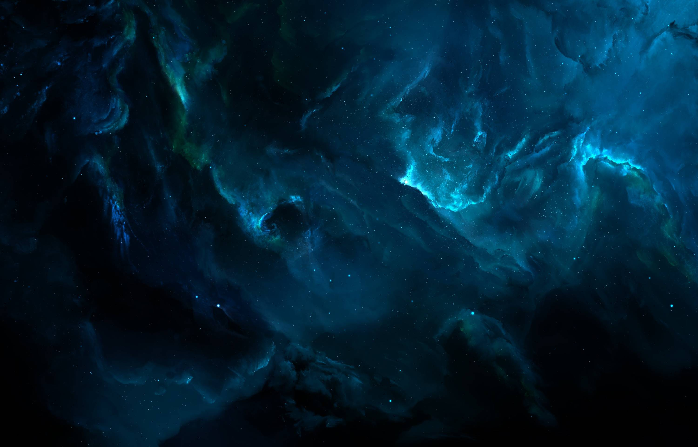

# Kurt Ian Bernaldez - Portfolio

A modern single-page portfolio website featuring a dark cosmic theme with smooth GSAP scroll animations.

🔗 **Live Demo:** [kurtianbernaldez.github.io](https://kurtianbernaldez.github.io) *(update with your actual URL)*



## ✨ Features

- **Dark Cosmic Theme** - Elegant dark design with nebula-inspired backgrounds
- **GSAP Animations** - Smooth scroll-triggered animations and transitions
- **Responsive Design** - Optimized for desktop, tablet, and mobile
- **Glassmorphism Effects** - Modern frosted glass UI elements
- **Business Card Contact** - Unique landscape business card layout

## 📂 Sections

| Section | Description |
|---------|-------------|
| **Hero** | Full-screen intro with cosmic background |
| **About** | Education, skills, and personal info |
| **Featured Works** | Project showcase with mockup toggle |
| **Tools** | Tech stack organized by category |
| **Contact** | Business card style contact info |

## 🛠️ Built With

- HTML5 & CSS3 (Grid, Flexbox, Custom Properties)
- Vanilla JavaScript
- [GSAP](https://greensock.com/gsap/) with ScrollTrigger
- Google Fonts

## 🚀 Quick Start

```bash
# Clone the repository
git clone https://github.com/YOUR_USERNAME/YOUR_REPO.git

# Open in browser
open index.html
```

Or simply visit the live demo link above.

## 📁 Project Structure

```
├── index.html
├── styles/
│   └── main.css
├── scripts/
│   ├── main.js
│   ├── animations.js
│   └── projects.js
└── images/
    ├── projects/
    │   └── mockups/
    └── ...
```

## 📄 License

© 2025 Kurt Ian Bernaldez. All rights reserved.
